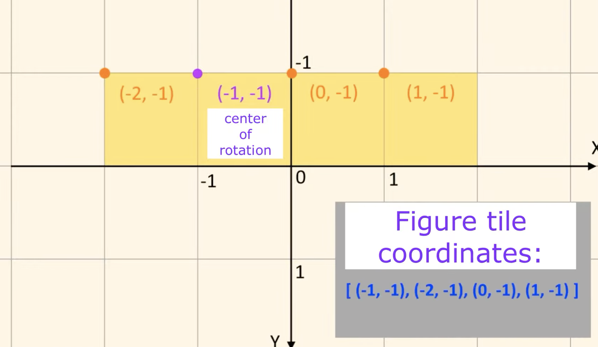

# Tetris

## Source

[参考 Youtube](https://www.youtube.com/watch?v=7kGNs5R-AM8)

Figure coordinate


## 開発環境

### Setup

```bash
# create python virtual environment
pyenv shell 3.9.15
python -m venv .venv

# activate virtual environment
source .venv/bin/activate

# package install
pip install --requirement requirements.txt

# dependences
brew install cairo # for svg loading

# run app
python main.py
```

### 開発

```bash
pip freeze > requirements.txt
```
