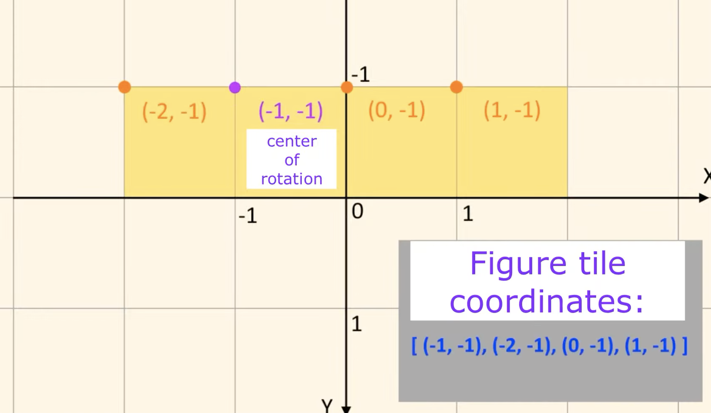

# Tetris


## Source

[参考 Youtube](https://www.youtube.com/watch?v=7kGNs5R-AM8)


Figure coordinate



## 開発環境

```bash
python --version
# Python 3.9.15

source .venv/bin/activate

python main.py
```